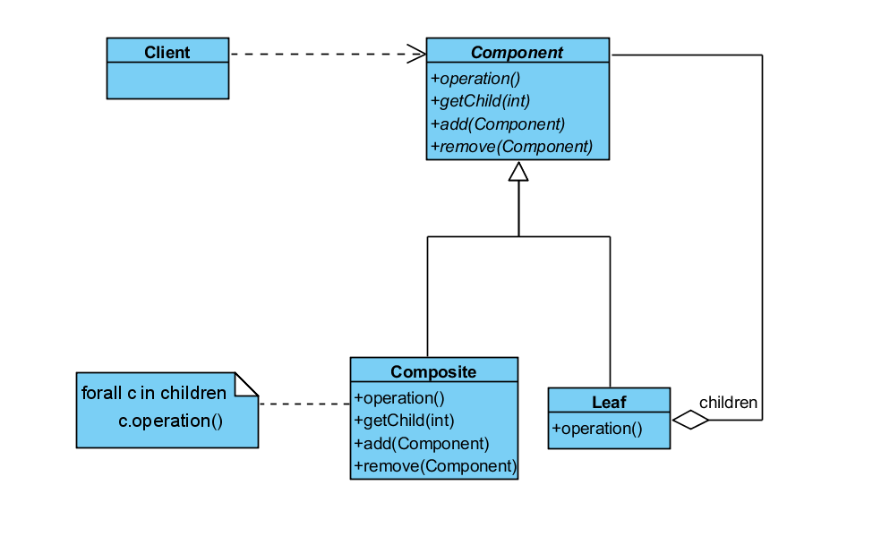
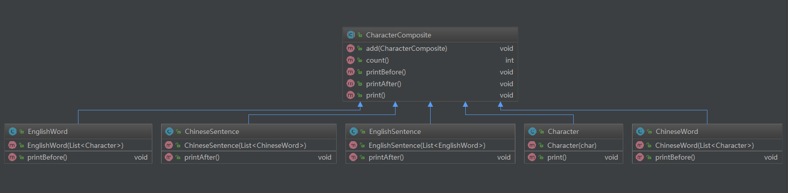

# 組合模式 ( Composite )

## 用途

將對象組合成樹形結構以表示 “部分——整體” 的層次結構。 

Composite使得用戶對單個對象和組合對象的使用具有一致性。

## 模式要點

### 組成部分
* Component : 是組合中的所有對象的統一接口；定義了特定情況下，類應當實現的貨缺省的行為；Component 聲明一個接口用于訪問和管理 Component 的子組件；在遞歸結構中定義一個接口，用于訪問一個父部件，並符合條件的類中實現它，當然這個是可選的。
* Leaf：在組合中表示葉節點對象，顧名思義，葉節點沒有子節點。
* Composite：定義有子部件的那些部件的行為，同時存儲子部件，實現 Component 中與子部件有關的接口。
* Client：通過Component接口，操縱組合部件的對象。
### 協作原理
* 用戶使用Component類接口與組合結構中的對象進行交互。 如果接收者是一個葉節點，則直接處理請求。 如果接收者是Composite， 它通常將請求发送給它的子部件， 在轉发請求之前與/或之后可能執行一些輔助操作。

## 實例分析
在中文中，一句話是由詞語組成的，而詞語又由字組成；在英文中，句子由單詞組成，而單詞又由一個個字母組成。每個對象都可定義的它之前的或之后的內容。比如一個中文句子總是以句號結尾，一個英文單詞之前通常是有空格的。這種結構可以形成了遞歸嵌套的結構，句子是父容器，單詞是子容器，字母是葉節點。

CharacterComposite 是一個抽象類，定義了所有容器類或葉節點的接口，容器應當實現的功能有：獲取子組件、對子組件進行計數、定義組件的格式化輸出規則。Sentence(句子) 和 Word (單詞)都屬于容器，而 Character (字母)則屬于葉節點，因為字母中無法再添加子組件了，它是層次結構中的最末端。
```
/**
 * 所有容器的抽象父類
 */
public abstract class CharacterComposite {

  private List<CharacterComposite> children = new ArrayList<>();

  public void add(CharacterComposite character) {
    children.add(character);
  }

  public int count() {
    return this.children.size();
  }

  public void printBefore() {
  }

  public void printAfter() {
  }

  public void print() {
    printBefore();
    for (CharacterComposite item : children) {
      item.print();
    }
    printAfter();
  }
}
```
EnglishWord 組件前應當輸出一個空格，EnglishSentence 組件后應當輸出一個“.”，ChineseSentence 組件后應當輸出一個“。”等。
```
/**
 * 英文句子
 */
public class EnglishSentence extends CharacterComposite {

  public EnglishSentence(List<EnglishWord> words) {
    for (EnglishWord word : words) {
      add(word);
    }
  }

  @Override
  public void printAfter() {
    System.out.println(".");
  }
}
```

```
/**
 * 英文單詞
 */
public class EnglishWord extends CharacterComposite {

  public EnglishWord(List<Character> characters) {
    for (Character c : characters) {
      add(c);
    }
  }

  @Override
  public void printBefore() {
    System.out.print(" ");
  }
}
```
Word 作為 Sentence 的子容器，Character 作為 Word 的子組件，屬于葉節點。
```
/**
 * 字母
 */
public class Character extends CharacterComposite {

  private char c;

  public Character(char c) {
    this.c = c;
  }

  @Override
  public void print() {
    System.out.print(c);
  }
}
```
Writer 為句子生成器，各個組件及子組件均由它負責填充，最終形成一個完成的結構。
```
/**
 * 語句生成器
 */
public class Writer {

  public CharacterComposite sentenceByChinese() {
    List<ChineseWord> words = new ArrayList<>();

    words.add(new ChineseWord(Arrays.asList(new Character('我'))));
    words.add(new ChineseWord(Arrays.asList(new Character('是'))));
    words.add(new ChineseWord(Arrays.asList(new Character('來'), new Character('自'))));
    words.add(new ChineseWord(Arrays.asList(new Character('北'), new Character('京'))));
    words.add(new ChineseWord(Arrays.asList(new Character('的'))));
    words.add(new ChineseWord(Arrays.asList(new Character('小'), new Character('明'))));

    return new ChineseSentence(words);
  }

  public CharacterComposite sentenceByEnglish() {
    List<EnglishWord> words = new ArrayList<>();

    words.add(new EnglishWord(Arrays.asList(new Character('I'))));
    words.add(new EnglishWord(Arrays.asList(new Character('a'), new Character('m'))));
    words.add(new EnglishWord(Arrays.asList(new Character('a'))));
    words.add(new EnglishWord(Arrays.asList(new Character('s'), new Character('t'), new Character('u'), new Character('d'), new Character('e'), new Character('n'), new Character('t'))));
    words.add(new EnglishWord(Arrays.asList(new Character('f'), new Character('r'), new Character('o'), new Character('m'))));
    words.add(new EnglishWord(Arrays.asList(new Character('L'), new Character('o'), new Character('n'), new Character('d'), new Character('o'), new Character('n'))));

    return new EnglishSentence(words);
  }
}
```

## 效果
* Composite 模式定義了基本對象和組合對象的基本層次結構，基本對象可以組合形成更復雜的對象，這個對象還可以再次進行組合，依次類推，可以實現無限層的遞歸嵌套結構，上文中提到的句子-單詞-字母結構即是如此。
* 所有的容器都是這個接口的實現，用戶可以一致地使用組合結構和單個對象，用戶不需要知道它是否為葉節點或包含子容器的一個組件，從而大大簡化了代碼結構，定義組合的類時避免了各種復雜的包含著大量判斷的方法。
* 在增加新的組件的時候更簡單，無論是新增一種容器或一個葉節點都很方便，無需單獨再定義新類並且可以很容易和現有的組件或容器結合工作，客戶端無需隨新組件的增加而做任何改變
* 使代碼結構更具通用性，但也存在一些問題。增加組件很方便，但無法對子組件做過多的限制，即使客戶希望在容器中只增加某種特定的組件，由于使用 Composite 而無法依靠別的類做過多的約束，這些檢驗類型的工作就要放到運行時去做了

## 適用場景
* 你想表示對象的部分-整體層次結構
* 你希望用戶忽略組合對象與單個對象的不同， 用戶將統一地使用組合結構中的所有對象
