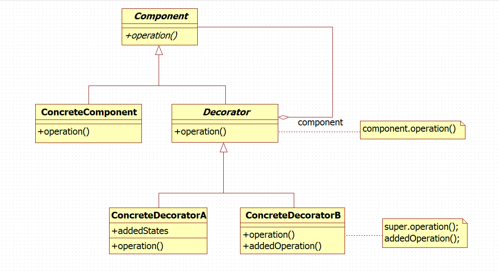
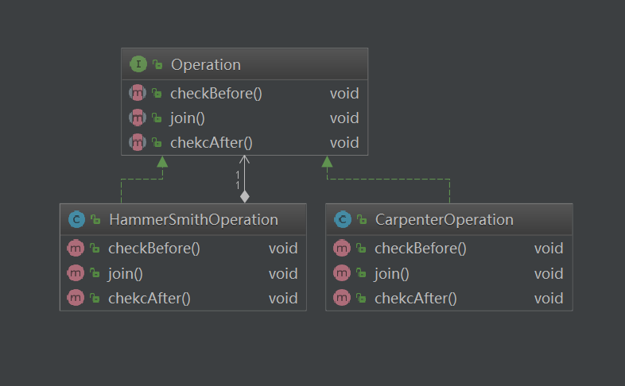

# 裝飾模式 ( Decorator )

## 用途
用于動態地給一個對象添加一些額外的職責。 就增加功能來說， Decorator模式相比生成子類更為靈活。裝飾模式以對客戶端透明的方式擴展對象的功能，是繼承關系的一個替代方案。

純粹的裝飾模式很難找到，大多數的裝飾模式的實現都是“半透明”的，而不是完全透明的。換言之，允許裝飾模式改變接口，增加新的方法。半透明的裝飾模式是介于裝飾模式和適配器模式之間的。適配器模式的用意是改變所考慮的類的接口，也可以通過改寫一個或几個方法，或增加新的方法來增強或改變所考慮的類的功能。                                                                                     大多數的裝飾模式實際上是半透明的裝飾模式，這樣的裝飾模式也稱做半裝飾、半適配器模式。

## 適用場景

以下情況使用Decorator模式
* 在不影響其他對象的情況下， 以動態、 透明的方式給單個對象添加職責。
* 處理那些可以撤消的職責。
* 當不能采用生成子類的方法進行擴充時。 一種情況是， 可能有大量獨立的擴展， 為支持每一種組合將產生大量的子類， 使得子類數目呈爆炸性增長。 另一種情況可能是因為類定義被隱藏， 或類定義不能用于生成子類。

## 模式要點



### 組成部分
* Component：定義一個對象接口， 可以給這些對象動態地添加職責。
* ConcreteComponent：定義一個對象， 可以給這個對象添加一些職責。
* Decorator：持有一個指向 Component 對象的引用，並定義一個與 Component 接口一致的接口。
* ConcreteDecorator：一向組件添加職責。

### 協作原理
* Decorator 將請求轉发給它的 Component 對象， 並有可能在轉发請求前后執行一些附加的動作。

## 實例分析


鐵匠和木匠同時制作一把鐵錘，第一種方案是木匠制作錘把，鐵匠制作錘頭；第二中方案是鐵匠先制作錘把再制作錘頭（假定這里的木匠只會制作錘把）。制作過程分為三部分：1.對材料進行初步的檢查，2.進行制造並把部件安裝起來以供后面的操作，3.完成之后再次進行檢查，確保沒有質量問題。

首先定義“操作”接口，包括前后兩次檢查以及安裝的操作。

```
/**
 * 流水線上操作行為的接口
 */
public interface Operation {

  void checkBefore();

  void join();

  void chekcAfter();
}
```
現在只由木匠制作錘把，定義一個木匠的操作類 CarpenterOperation
```
/**
 * 木匠的工作
 */
public class CarpenterOperation implements Operation {

  private static final Logger LOGGER = LoggerFactory.getLogger(CarpenterOperation.class);

  @Override
  public void checkBefore() {
    LOGGER.info("檢查木材");
  }

  @Override
  public void join() {
    LOGGER.info("打造錘把");
  }

  @Override
  public void chekcAfter() {
    LOGGER.info("檢查成品錘把");
  }
}
```
由于某些原因，鐵匠決定自己制作錘把，現在鐵匠身兼雙職，將木匠的工作也承擔了。定義一個鐵匠操作類 HammerSmith
```
/**
 * 鐵匠
 */
public class HammerSmithOperation implements Operation {

  private static final Logger LOGGER = LoggerFactory.getLogger(HammerSmithOperation.class);
  private Operation previousOperation;

  public HammerSmithOperation(Operation previousOperation) {
    this.previousOperation = previousOperation;
  }

  @Override
  public void checkBefore() {
    previousOperation.checkBefore();
    LOGGER.info("檢查鐵材");
  }

  @Override
  public void join() {
    previousOperation.join();
    LOGGER.info("打造錘頭");
  }

  @Override
  public void chekcAfter() {
    previousOperation.chekcAfter();
    LOGGER.info("檢查成品錘頭");
  }
}
```

同樣實現了“操作”的接口，鐵匠的每個操作都包含了木匠相應的操作，相當于對木匠的操作增加了一層包裹和擴展。這種包裝就是 Decorator 模式中的裝飾。

現在分別讓木匠和鐵匠進行一系列操作
```
/**
 * Decorator
 */
public class com.kyocoolcool.ovserver.Application {

  private static final Logger LOGGER = LoggerFactory.getLogger(com.kyocoolcool.ovserver.Application.class);

  public static void main(String[] args) {
    LOGGER.info("僅由木匠制作錘把");
    Operation carpenter = new CarpenterOperation();
    carpenter.checkBefore();
    carpenter.join();
    carpenter.chekcAfter();

    LOGGER.info("由鐵匠完成錘把以及錘頭的制作");
    Operation hammerSmith = new HammerSmithOperation(carpenter);
    hammerSmith.checkBefore();
    hammerSmith.join();
    hammerSmith.chekcAfter();
  }
}
```
輸出如下內容
```
    僅由木匠制作錘把
    檢查木材
    打造錘把
    檢查成品錘把
    
    由鐵匠完成錘把以及錘頭的制作
    檢查木材
    檢查鐵材
    打造錘把
    打造錘頭
    檢查成品錘把
    檢查成品錘頭
```

## 效果
### 優點
1. 裝飾模式和靜態繼承的機制的作用都是對現有的類增加新的功能，但裝飾模式有著比靜態繼承更靈活的組合方式。裝飾模式可以在運行的時候決定需要增加還是去除一種“裝飾”以及什么“裝飾”。靜態繼承則沒有這樣的靈活性，它對類功能的擴展是在運行之前就確定了的。
2. 得益于裝飾模式在組合上的靈活性和便利性，我們可以將各種裝飾類進行組合，從而較為簡單的創造各種不同的行為集合，實現多種多樣的功能。
### 缺點
1. 裝飾者的對象和它裝飾的對象本質上是完全不同的，裝飾模式會生成許多的對象，導致區分各種對象變得困難
2. 由于使用相同的標識，對于程序的理解和拍錯過程的難度也會隨之增加
