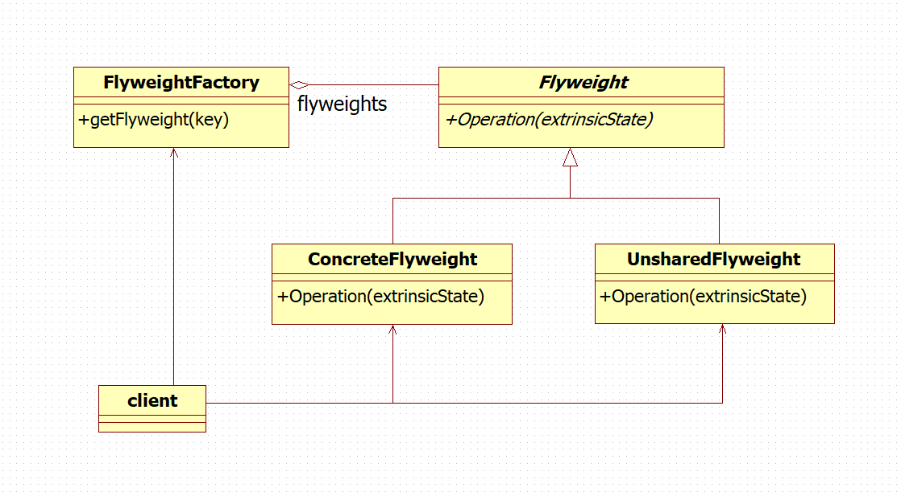
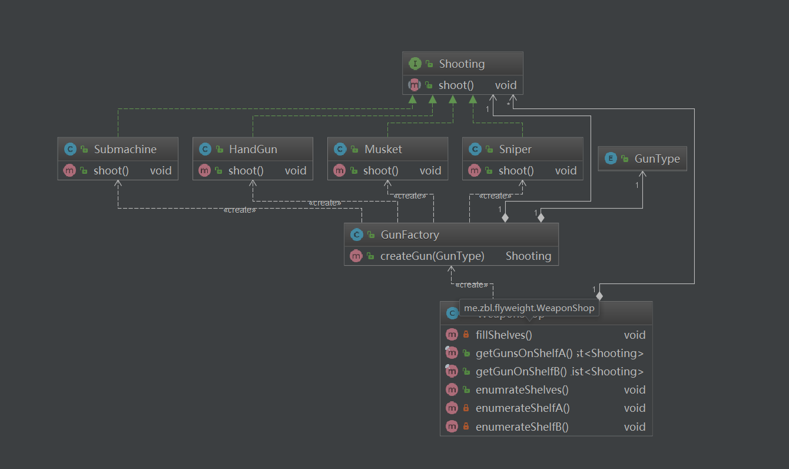

# 享元模式 ( Flyweight )

## 用途

運用共享技術有效地支持大量細粒度的對象。

## 適用場景

Flyweight模式的有效性很大程度上取決于如何使用它以及在何處使用它。 當以下情況都成立時使用flyweight模式：
* 一個應用程序使用了大量的對象。
* 完全由于使用大量的對象，造成很大的存儲開銷。
* 對象的大多數狀態都可變為外部狀態。
* 如果刪除對象的外部狀態，那么可以用相對較少的共享對象取代很多組對象。
* 應用程序不依賴于對象標識。由于Flyweight對象可以被共享，對于概念上明顯有別的對象，標識測試將返回真值。

## 模式要點



### 組成部分

* Flyweight - 描述一個接口， 通過這個接口 flyweight 可以接受並作用于外部狀態。
* ConcreteFlyweight — 實現 Flyweight 接口，並為內部狀態（如果有的話）增加存儲空間 。ConcreteFlyweight對象必須是可共享的。 它所存儲的狀態必須是內部的；即它必須獨立于 ConcreteFlyweight 對象的場景。
* UnsharedConcreteFlyweight — 並非所有的 Flyweight 子類都需要被共享。Flyweight 接口使共享成為可能， 但它並不強制共享。 在 Flyweight 對象結構的某些層次，UnsharedConcreteFlyweight 對象通常將 ConcreteFlyweight 對象作為子節點。
* FlyweightFactory — 創建並管理 flyweight 對象。確保合理地共享 flyweight。當用戶請求一個 flyweight 時，FlyweightFactory 對象提供一個已創建的實例或者創建一個（如果不存在的話)。
* Client：持有一個對 flyweight 的引用。計算或存儲一個（多個）flyweight 的外部狀態。

### 協作原理

* flyweight 執行時所需的狀態必定是內部的或外部的。內部狀態存儲于 ConcreteFlyweight 對象之中；而外部對象則由 Client 對象存儲或計算。當用戶調用 flyweight 對象的操作時，將該狀態傳遞給它。
* 用戶不應直接對 ConcreteFlyweight 類進行實例化， 而只能從 FlyweightFactory 對象得到 ConcreteFlyweight 對象，這可以保證對它們適當地進行共享。

## 實例分析



出售武器的商店里擺滿了各式的槍。許多槍的型號是一樣的，所以不需要為每一個都創建新的對象。相反，一個對象實例可以表示多個貨架項目，因此內存占用空間很小。

所有的槍都可以发出射擊這個動作，因此定義一個槍的接口 Shooting
```
public interface Shooting {

  void shoot();
}
```

商店里的槍可以大致分為手槍、步槍、狙擊槍和衝鋒槍，分別定義四種槍類，它們都實現 Shooting 接口
```
/**
 * 手槍
 */
public class HandGun implements Shooting {

  private static final Logger LOGGER = LoggerFactory.getLogger(HandGun.class);

  @Override
  public void shoot() {
    LOGGER.info("手槍開火了(Hash={})", System.identityHashCode(this));
  }
}
```
```
/**
 * 步槍
 */
public class Musket implements Shooting {

  private static final Logger LOGGER = LoggerFactory.getLogger(Musket.class);

  @Override
  public void shoot() {
    LOGGER.info("步槍開火了(Hash={})", System.identityHashCode(this));
  }
}
```

```
/**
 * 狙擊槍
 */
public class Sniper implements Shooting {

  private static final Logger LOGGER = LoggerFactory.getLogger(Sniper.class);

  @Override
  public void shoot() {
    LOGGER.info("狙擊槍開火了(Hash={})", System.identityHashCode(this));
  }
}
```

```
/**
 * 衝鋒槍
 */
public class Submachine implements Shooting {

  private static final Logger LOGGER = LoggerFactory.getLogger(Submachine.class);

  @Override
  public void shoot() {
    LOGGER.info("衝鋒槍開火了(Hash={})", System.identityHashCode(this));
  }
}
```

武器的生成由武器工廠類完成，同一種槍只存在一個對象
```
/**
 * 武器工廠
 */
public class GunFactory {

  private Map<GunType, Shooting> gunRepo;

  public GunFactory() {
    gunRepo = new EnumMap<GunType, Shooting>(GunType.class);
  }

  public Shooting createGun(GunType type) {
    Shooting gun = gunRepo.get(type);
    if (null == gun) {
      switch (type) {
        case HANDGUN: {
          gun = new HandGun();
          gunRepo.put(HANDGUN, gun);
          break;
        }
        case MUSKET: {
          gun = new Musket();
          gunRepo.put(MUSKET, gun);
          break;
        }
        case SNIPER: {
          gun = new Sniper();
          gunRepo.put(SNIPER, gun);
          break;
        }
        case SUBMACHINE: {
          gun = new Submachine();
          gunRepo.put(SUBMACHINE, gun);
          break;
        }
      }
    }
    return gun;
  }
}
```

武器商店使用武器工廠獲得各種槍，放到兩個不同的貨架上
```
/**
 * 武器商店
 */
public class WeaponShop {

  private static final Logger LOGGER = LoggerFactory.getLogger(WeaponShop.class);

  private List<Shooting> shelfA;
  private List<Shooting> shelfB;

  public WeaponShop() {
    shelfA = new ArrayList<>();
    shelfB = new ArrayList<>();
    fillShelves();
  }

  private void fillShelves() {
    GunFactory factory = new GunFactory();

    shelfA.add(factory.createGun(HANDGUN));
    shelfA.add(factory.createGun(HANDGUN));
    shelfA.add(factory.createGun(MUSKET));
    shelfA.add(factory.createGun(MUSKET));
    shelfA.add(factory.createGun(SNIPER));
    shelfA.add(factory.createGun(SNIPER));
    shelfA.add(factory.createGun(MUSKET));
    shelfA.add(factory.createGun(HANDGUN));

    shelfB.add(factory.createGun(SUBMACHINE));
    shelfB.add(factory.createGun(SUBMACHINE));
    shelfB.add(factory.createGun(SUBMACHINE));
    shelfB.add(factory.createGun(SNIPER));
  }

  public final List<Shooting> getGunsOnShelfA() {
    return Collections.unmodifiableList(shelfA);
  }

  public final List<Shooting> getGunOnShelfB() {
    return Collections.unmodifiableList(shelfB);
  }

  public void enumrateShelves() {
    enumerateShelfA();
    enumerateShelfB();
  }

  private void enumerateShelfA() {
    LOGGER.info("從A貨架上拿走所有武器");
    for (Shooting gun : shelfA) {
      gun.shoot();
    }
  }

  private void enumerateShelfB() {
    LOGGER.info("從B貨架上拿走所有武器");
    for (Shooting gun : shelfB) {
      gun.shoot();
    }
  }
}
```

使用
```
    WeaponShop shop = new WeaponShop();
    shop.enumrateShelves();
```
## 效果

使用 Flyweight 模式時， 傳輸、 查找和/或計算外部狀態都會產生運行時的開銷， 尤其當 flyweight 原先被存儲為內部狀態時。然而，空間上的節省抵消了這些開銷。共享的 flyweight 越多， 空間節省也就越大。

存儲節約由以下几個因素決定：

* 因為共享，實例總數減少的數目
* 對象內部狀態的平均數目
* 外部狀態是計算的還是存儲的共享的Flyweight越多，存儲節約也就越多。節約量隨著共享狀態的增多而增大。當對象使用大量的內部及外部狀態，並且外部狀態是計算出來的而非存儲的時候，節約量將達到最大。所以，可以用兩種方法來節約存儲：用共享減少內部狀態的消耗，用計算時間換取對外部狀態的存儲。

Flyweight 模式經常和 Composite 模式結合起來表示一個層次式結構， 這一層次式結構是一個共享葉節點的圖。 共享的結果是， Flyweight的葉節點不能存儲指向父節點的指針。而父節點的指針將傳給 Flyweight 作為它的外部狀態的一部分。這對于該層次結構中對象之間相互通訊的方式將產生很大的影響。
